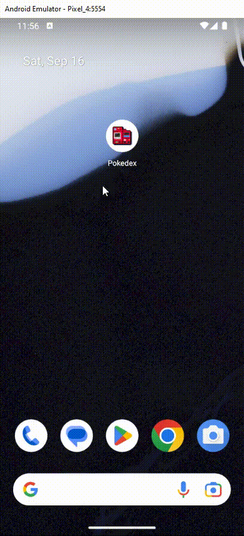

<h1 align="center">
    
    <p>Flutter Pokedex Mobile</p>
</h1>

<p align="center">
  <a href="#projeto">Projeto</a>&nbsp;|
  <a href="#funcionalidades">Funcionalidades</a>&nbsp;|
  <a href="#tecnologias">Tecnologias</a>&nbsp;|
  <a href="#instalacao">Instalação</a>&nbsp;|
  <a href="#links">Links</a>&nbsp;|
  <a href="#licenca">Licença</a>
</p>

<p align="center">
  
</p>

<p align="center">
  
</p>

<div id='projeto'>
  <h2 style="color: #87CEFA;"> 💻 Projeto </h2>
  Projeto de uma pokedex mobile desenvolvida em flutter para fins de estudo da tecnologia
</div>

<div id='funcionalidades'>
  <h2 style="color: #87CEFA;">🔨 Funcionalidades</h2>

  O projeto consta com as seguintes funcionalidades:

  - Barra de pesquisa por nome ou ID
  - Botões para próximo ou anterior
  

</div>

<div id='tecnologias'>
  <h2 style="color: #87CEFA;">🚀 Tecnologias</h2>

  <p>
  Esse projeto foi desenvolvido com as seguintes tecnologias:

  - [Flutter](https://flutter.dev/)
  - [Dart](https://dart.dev/)
  </p>
</div>

<div id='instalacao'>
  <h2 style="color: #87CEFA;">📥 Instalação</h2>

  ```bash
  #Clone repositório
  git clone https://github.com/renangabriel08/pokedex_mobile.git

  #Instalando dependencias
  cd pokedex
  flutter pub get
```
  
</div>

<div id='links'>
  <h2 style="color: #87CEFA;">📍 Links</h2>

- [LinkedIn](https://www.linkedin.com/in/renan-gabriel/)
- [Github](https://github.com/renangabriel08)
- [PokeAPI](https://pokeapi.co/)
- [Download Flutter](https://flutter.dev/)
- [Download Emulador](https://developer.android.com/studio)
</div>

<div id='licenca'>
  <h2 style="color: #87CEFA;">📑 Licença</h2>

  <p>Esse projeto está sob a licença MIT.</p>
</div>